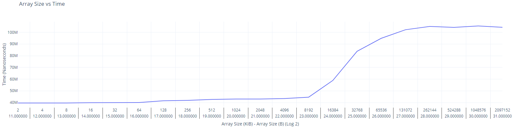

# Report

+ Used Go version 1.17
+ Used online external plotting tool (provided plot images)
+ Files:
    + go.mod
    + main.go
    + out.csv
    + report.md
    + size-vs-time.png
    + size-vs-time-analysis.png

## lscpu (My CPU cache configuration)
```
L1d cache:                       192 KiB
L1i cache:                       192 KiB
L2 cache:                        1.5 MiB
L3 cache:                        12 MiB
```

## Results




## Algorithm

The algorithm that I used draws heavy inspiration from the [Gallery of Processor Cache Effecs](https://igoro.com/archive/gallery-of-processor-cache-effects/) website, under the Example 3 heading. It was somewhat effective in that it was able to infer that the L3 cache size is somewhere between 8192 and 16384 KiB in size (8 to 16 KiB) based on the data that the algorithm produced by timing data access, to see whether this data used one of the cpu caches such as L3 cache, or used main memory.

## Software usage

```
go run main.go > out.csv
```
